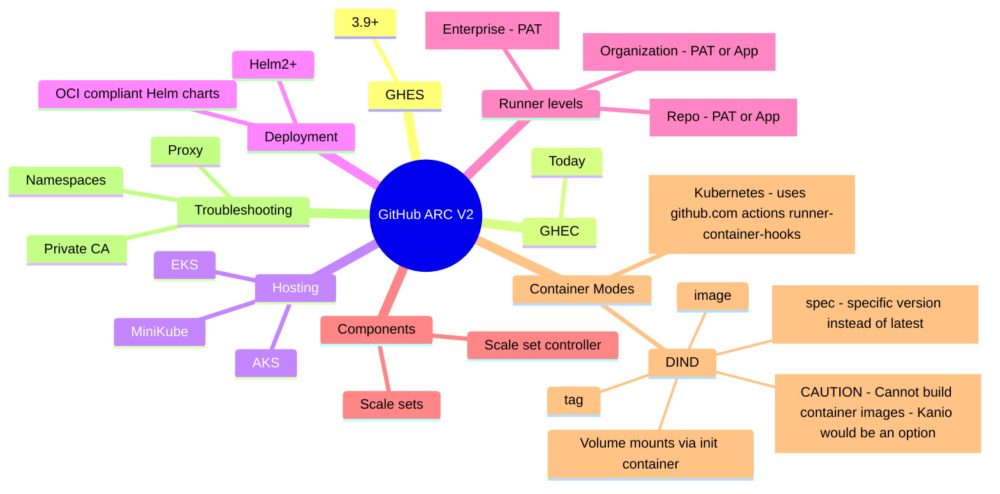

# A mindmap about the v2 actions runner controller after GitHub moved this under /actions/
https://github.com/actions/actions-runner-controller

```mermaid
mindmap
  root((GitHub ARC V2))
    GHES
      3.9+
    GHEC
      Today
    Hosting
      AKS
      EKS
      MiniKube
    Deployment
      Helm2+
      OCI compliant Helm charts
    Runner levels
      [Enterprise - PAT]
      [Organization - PAT or App]
      [Repo - PAT or App]
    Components
      Scale set controller
      Scale sets
    Container Modes
      DIND
        [CAUTION - Cannot build container images - Kanio would be an option]
        Volume mounts via init container
        image
        tag
        [spec - specific version instead of latest]
      [Kubernetes - uses github.com actions runner-container-hooks]
    Troubleshooting
      Namespaces
      Private CA
      Proxy        

```
