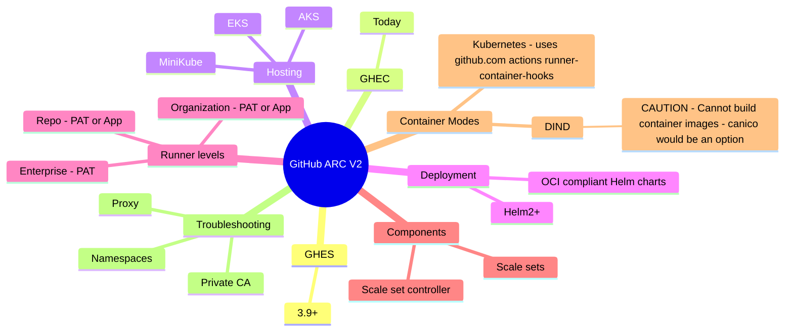

```mermaid
mindmap
  root((GitHub ARC V2))
    GHES
      3.9+
    GHEC
      Today
    Hosting
      AKS
      EKS
      MiniKube
    Deployment
      Helm2+
      OCI compliant Helm charts
    Runner levels
      Enterprise - PAT
      Organization - PAT or App
      Repo - PAT or App
    Components
      Scale set controller
      Scale sets
    Container Modes
      DIND
        CAUTION - Cannot build container images - canico would be an option
      Kubernetes - uses github.com actions runner-container-hooks
    Troubleshooting
      Namespaces
      Private CA
      Proxy  
      
```
