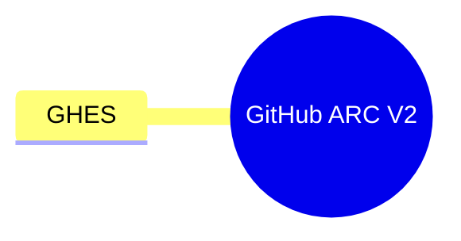

# Actions



```mermaid
mindmap
  orientation: right
  My Root Node
  - Child Node 1
  -- Child Node 1.1
  -- Child Node 1.2
  --- Child Node 1.2.1
  --- Child Node 1.2.2
  -- Child Node 1.3
  - Child Node 2
  -- Child Node 2.1
  --- Child Node 2.1.1
```
