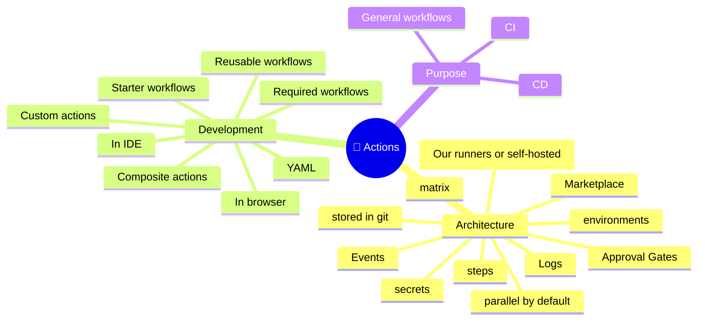

# Actions

```mermaid
mindmap
  root((🚀 Actions ))
    Architecture
      Marketplace
      Events
      [Our runners or self-hosted]
      steps
      parallel by default
      matrix
      secrets
      environments
      stored in git
      Logs
      Approval Gates
    Development
      YAML
      In browser
      In IDE
      Composite actions
      Custom actions
      Reusable workflows
      Required workflows
      Starter workflows
    Purpose
      CI
      CD
      General workflows
```
