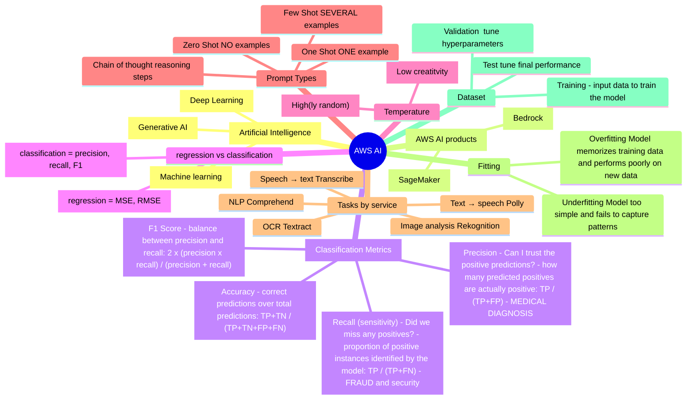

A mindmap I built to help those studying for [AWS Certified AU Practitioner AID-C01](https://aws.amazon.com/certification/certified-ai-practitioner/?ch=sec&sec=rmg&d=1)

```mermaid
mindmap
  root(("AWS AI"))
    ai["Artificial Intelligence"]
      ml["Machine learning"]
      dl["Deep Learning"]
      genai["Generative AI"]
    products["AWS AI products"]
      bedrock["Bedrock"]
      sagemaker["SageMaker"]
    metrics["Classification Metrics"]
      accuracy["Accuracy - correct predictions over total predictions: TP+TN / (TP+TN+FP+FN)"]
      precision["Precision - Can I trust the positive predictions? - how many predicted positives are actually positive: TP / (TP+FP) - MEDICAL DIAGNOSIS"]
      Recall["Recall (sensitivity) - Did we miss any positives? - proportion of positive instances identified by the model: TP / (TP+FN) - FRAUD and security"]
      f1["F1 Score - balance between precision and recall: 2 x (precision x recall) / (precision + recall)"]
    regression vs classification
      regression["regression = MSE, RMSE"]
      classification["classification = precision, recall, F1"]
    Temperature
      high["High(ly random)"]
      low[Low creatitvity]
    Prompt Types
      Zero Shot NO examples
      One Shot ONE example
      Few Shot SEVERAL examples
      Chain of thought reasoning steps
    Tasks by service
      OCR Textract
      Image analysis Rekognition
      NLP Comprehend
      Speech → text Transcribe
      Text → speech Polly
    Fitting
      Overfitting Model memorizes training data and performs poorly on new data
      Underfitting Model too simple and fails to capture patterns
    Dataset
      Training - input data to train the model
      Validation  tune hyperparameters
      Test tune final performance


```
