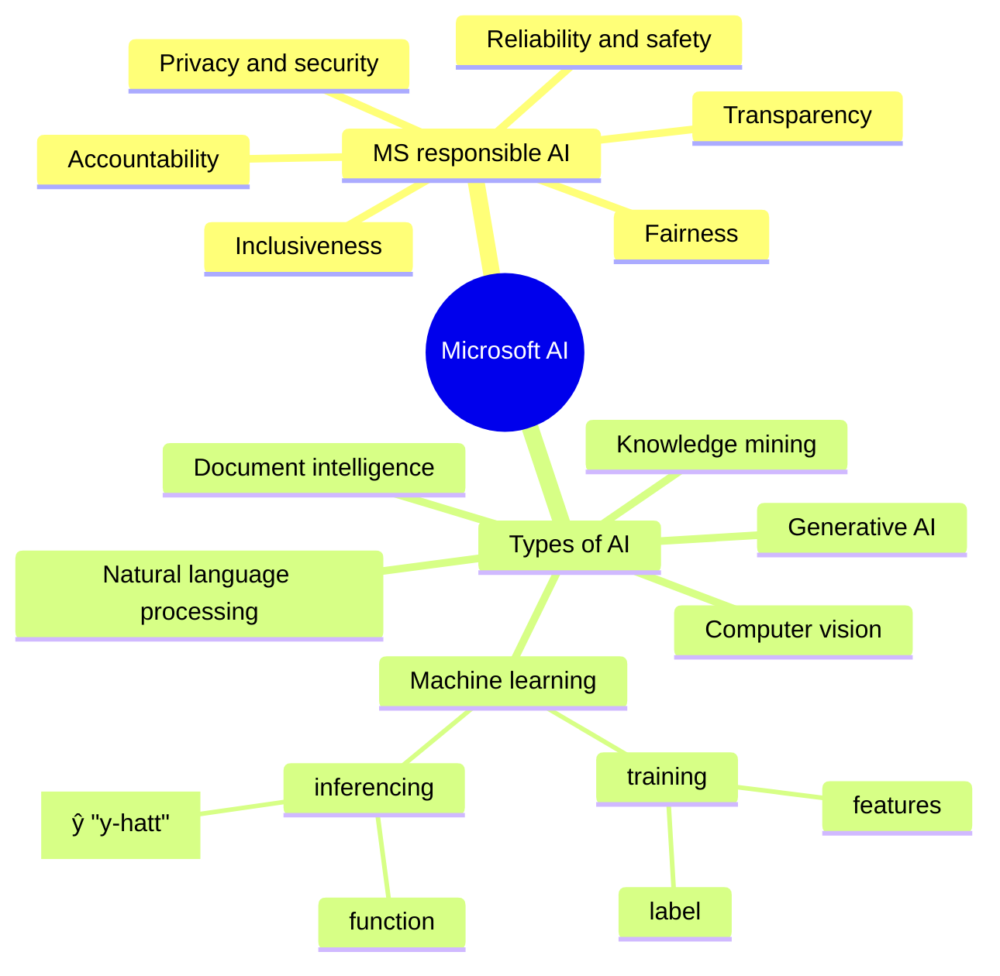

A mindmap I built whilst studying for [Microsoft AI Fundamentals](https://learn.microsoft.com/en-us/credentials/certifications/azure-ai-fundamentals/)

```mermaid
mindmap
  root((Microsoft AI))
    MS responsible AI
      Fairness
      Reliability and safety
      Privacy and security
      Inclusiveness
      Transparency
      Accountability  
    Types of AI
      Machine learning
        training
          features
          label
        inferencing
          function
          [ŷ "y-hatt"]
      Computer vision
      Natural language processing
      Document intelligence
      Knowledge mining
      Generative AI
      
```
