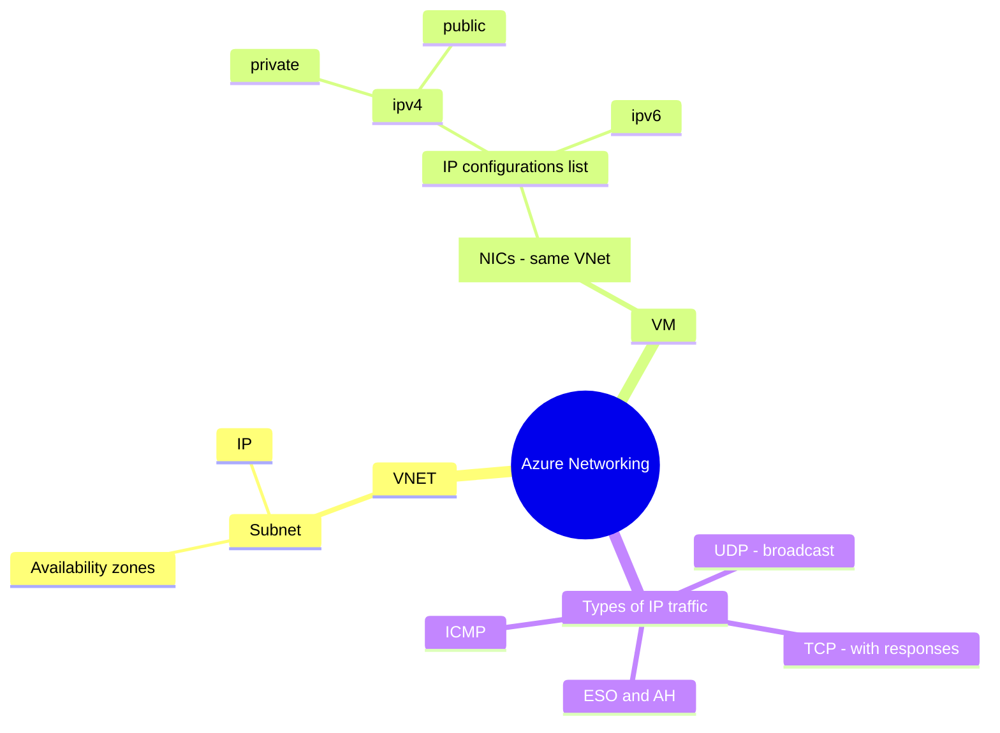

A mindmap I built to help people with Azure Networking

```mermaid
mindmap
  root((Azure Networking))
    VNET
      Subnet
        Availability zones
        IP
    VM
      [NICs - same VNet]
        IP configurations list
          ipv4
            private
            public
          ipv6
    Types of IP traffic
      UDP - broadcast
      TCP - with responses
      ESO and AH
      ICMP
      
```
