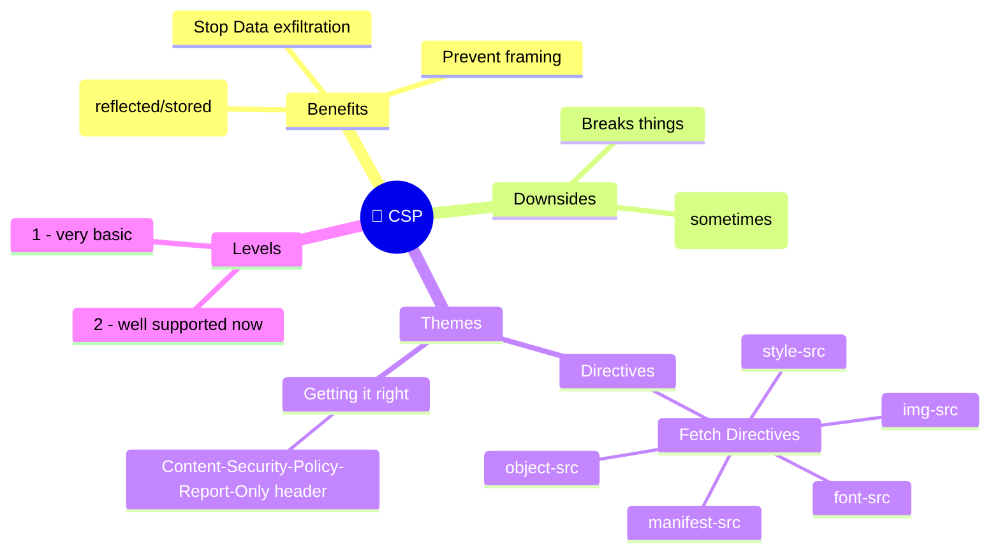

# Content Security Policies

```mermaid
mindmap
  root((🚀 CSP ))
    Benefits
      XSS (reflected/stored)
      Stop Data exfiltration
      Prevent framing
    Downsides
      Breaks things
      Not supported in every browser in the same way (sometimes)
    Themes
      Directives
        Fetch Directives
          manifest-src
          img-src
          font-src
          object-src
          style-src

      Getting it right
        Content-Security-Policy-Report-Only header
        
        
        
    Levels
      1 - very basic
      2 - well supported now
        
```
