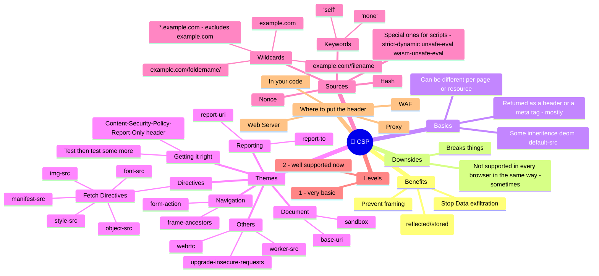

# Content Security Policies

```mermaid
mindmap
  root((🚀 CSP ))
    Benefits
      XSS (reflected/stored)
      Stop Data exfiltration
      Prevent framing
    Downsides
      Breaks things
      Not supported in every browser in the same way -sometimes
    Basics
      Returned as a header or a meta tag - mostly
      Can be different per page or resource
      Some inheritence deom default-src
    Themes
      Directives
        Fetch Directives
          manifest-src
          img-src
          font-src
          object-src
          style-src
      Navigation
        frame-ancestors
        form-action
      Reporting
        report-uri
        report-to
      Document
        sandbox
        base-uri
      Others
        worker-src
        webrtc
        upgrade-insecure-requests
      Getting it right
        Content-Security-Policy-Report-Only header
        Test then test some more
    Sources
      Keywords
        'self'
        'none'
      Hash
      Nonce
      Wildcards
        *.example.com - excludes example.com
        example.com
        example.com/filename
        example.com/foldername/
      Special ones for scripts - strict-dynamic unsafe-eval wasm-unsafe-eval
    Levels
      1 - very basic
      2 - well supported now
    Where to put the header
      In your code
      Web Server
      WAF
      Proxy
      
        
```
