# Content Security Policies

```mermaid
mindmap
  root((🚀 CSP ))
    Benefits
      XSS (reflected/stored)
      Stop Data exfiltration
      Prevent framing
    Downsides
      Breaks things
      Not supported in every browser in the same way -sometimes
    Basics
      Returned as a header or a meta tag - mostly
      Can be different per page or resource
      Some inheritence deom default-src
    Themes
      Directives
        Fetch Directives
          manifest-src
          img-src
          font-src
          object-src
          style-src
      Navigation
        frame-ancestors like X-FRAME-OPTIONS
        frame-src - what can you put inside this site?
        form-action
      Reporting - not well supported now
        report-uri
        report-to
      Document
        sandbox
        base-uri
      Others
        worker-src
        webrtc
        upgrade-insecure-requests
      Getting it right
        Content-Security-Policy-Report-Only header
        Test then test some more
        csp-evaluator.withgoogle.com
    Sources
      Keywords
        'self'
        'none'
      Hash
      Nonce
      Wildcards
        *.example.com - excludes example.com
        example.com
        example.com/filename
        example.com/foldername/
      Special ones for scripts - strict-dynamic unsafe-eval wasm-unsafe-eval
    Levels
      1 - very basic
      2 - well supported now
      3 - strict CSP
    Where to put the header
      In your code
      Web Server
      WAF
      Proxy
```



## Sample policies
### Vue.JS
```
Content-Security-Policy: default-src 'self'; script-src 'self'; style-src 'self'; font-src 'self'; img-src 'self'; frame-src 'self';
```

## Links
- [How to edit headers in Edge](https://learn.microsoft.com/en-us/microsoft-edge/devtools/javascript/overrides)
- [Web.Dev article on CSP](https://web.dev/articles/csp)
- [Great YouTube Video from NDC Security](https://youtu.be/eFbFMqaqSAk?si=jT4m4opwIcBUV6AU)
- [OWASP - Content Security Policy Cheat Sheet](https://cheatsheetseries.owasp.org/cheatsheets/Content_Security_Policy_Cheat_Sheet.html)
